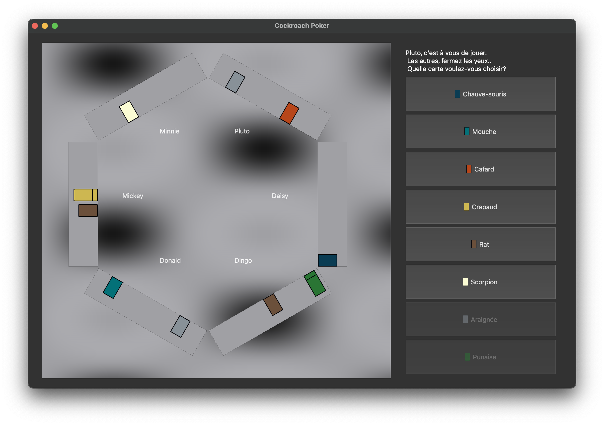

# [DEV4] Cockroach Poker



Cockroach Poker is a reverse set collection game that has nothing to do with poker – except that the game is all about
bluffing, with cards that show cockroaches, rats and stink bugs. The goal is to force another player to collect 4 of any
one type of critter. [Click here](https://www.ultraboardgames.com/cockroach-poker/game-rules.php) to read the rules

## Project structure

```
.
├── src
│   ├── controller
│   │   ├── controller.cpp
│   │   └── controller.hpp
│   ├── model
│   │   ├── cards
│   │   │   ├── card.cpp
│   │   │   ├── card.hpp
│   │   │   ├── cardcollection.cpp
│   │   │   ├── cardcollection.hpp
│   │   │   ├── cardtype.hpp
│   │   │   ├── deck.cpp
│   │   │   └── deck.hpp
│   │   ├── game
│   │   │   ├── game.cpp
│   │   │   ├── game.hpp
│   │   │   ├── gamestatus.hpp
│   │   │   ├── player.cpp
│   │   │   ├── player.hpp
│   │   │   ├── round.cpp
│   │   │   ├── round.hpp
│   │   │   └── roundstatus.hpp
│   │   ├── model.cpp
│   │   └── model.hpp
│   ├── utils
│   │   ├── observable.hpp
│   │   └── observer.hpp
│   ├── view
│   │   ├── components
│   │   │   ├── card.cpp
│   │   │   ├── card.hpp
│   │   │   ├── cardpile.cpp
│   │   │   ├── cardpile.hpp
│   │   │   ├── cardtable.cpp
│   │   │   ├── cardtable.hpp
│   │   │   └── cardtype.hpp
│   │   ├── scenes
│   │   │   ├── boardscene.cpp
│   │   │   └── boardscene.hpp
│   │   ├── widgets
│   │   │   ├── playerinput.cpp
│   │   │   └── playerinput.hpp
│   │   ├── windows
│   │   │   ├── boardwindow.cpp
│   │   │   ├── boardwindow.hpp
│   │   │   ├── cardpickerwindow.cpp
│   │   │   ├── cardpickerwindow.hpp
│   │   │   ├── playerpickerwindow.cpp
│   │   │   ├── playerpickerwindow.hpp
│   │   │   ├── receiverwindow.cpp
│   │   │   ├── receiverwindow.hpp
│   │   │   ├── startwindow.cpp
│   │   │   ├── startwindow.hpp
│   │   │   ├── valuepickerwindow.cpp
│   │   │   └── valuepickerwindow.hpp
│   │   ├── view.cpp
│   │   └── view.hpp
│   └── main.cpp
├── statement
│   └── dev4_2020_21_q3_cafards_withrules.pdf
├── test
│   ├── model
│   │   ├── cards
│   │   │   ├── cardcollectiontest.cpp
│   │   │   └── cardtest.cpp
│   │   └── game
│   │       └── playertest.cpp
│   └── maintest.cpp
├── CMakeLists.txt
├── LICENSE
├── Makefile
├── README.md
└── doxygen
```

## Compilation

### Requirements

- [ ] git
- [ ] make
- [ ] CMake (>= v3.19)
- [ ] GCC
- [ ] QT 6

### Make + CMake build

```bash
make release
```

you can find the compiled binary here: `./build/release/cockroach_poker`

## Documentation

```bash
make docs
```

you can find the compiled files here: `./docs`

## Unit Tests

```bash
make test
```
